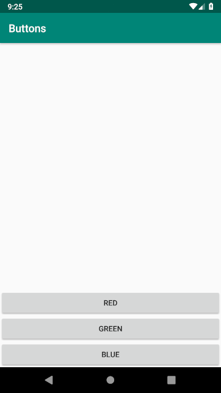
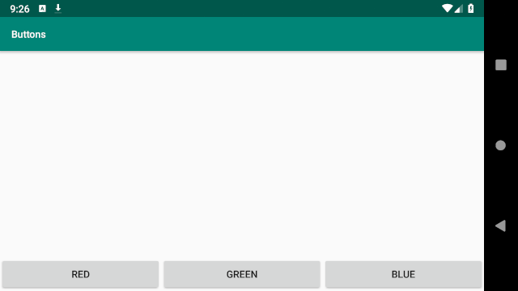
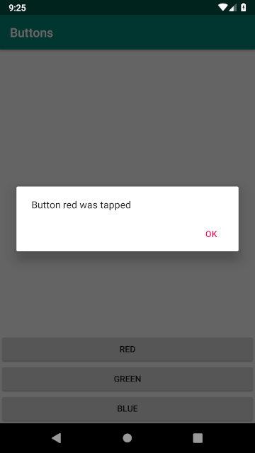

# Praca domowa z zajęć nr 2

Zadanie polega na stworzeniu prostej jednoekranowej aplikacji. Na ekranie znajdują się trzy przyciski o labelkach: **red**, **green** oraz **blue**. Kliknięcie każdego z nich powinno powodować pojawienie się prostego dialogu z napisem *Button $color was tapped* (np. w przypadku przycisku red ujrzymy *Button **red** was tapped*) oraz przyciskiem **OK**.

Żeby użyć resource'a jako treść dialogu polecam [formatted strings](https://developer.android.com/guide/topics/resources/string-resource#formatting-strings). Do stworzenia dialogu wykorzystajcie [AlertDialog](https://developer.android.com/guide/topics/ui/dialogs#AlertDialog).

Aby uruchomić testy, odnajdźcie w folderze `androidTest` jedyny pakiet `com.daftmobile.a4bhomework2` zawietający trzy pliki, kliknijcie na pakiet PPM i znajdźcie opcję **Run [...]** z ikonką zielonego trójkącika. Pamiętajcie, żeby wyłączyć animacje na waszym emulatorze/urządzeniu, inaczej testy mogą nie przechodzić - wujek Google wam pomoże ;)

Aplikacja powinna również wyglądać inaczej w przypadku orientacji ekranu pionowej i poziomej:

A tak powinien wyglądać dialog:

