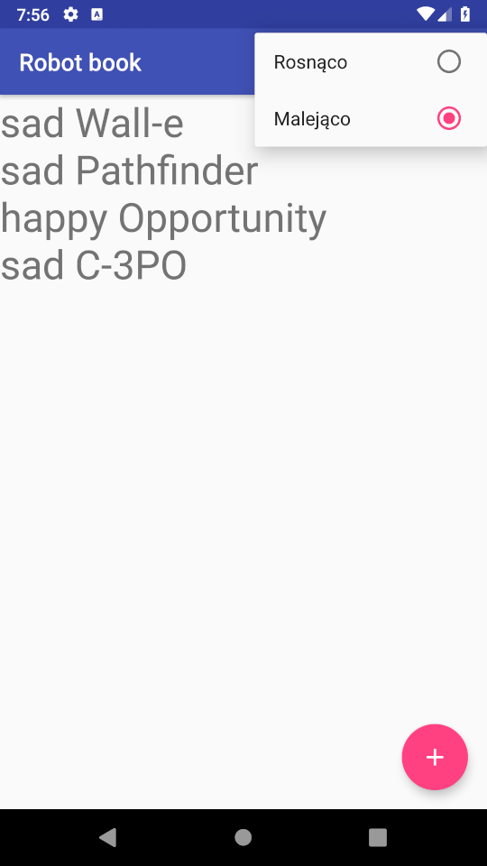

# Praca domowa z zajęć nr 4

Zadanie domowe rozszerza funkcjonalność aplikacji *Robot book*, którą zajmowaliśmy się na zajęciach. Celem jest dodanie funkcji sortowania robotów po ich nazwie.
Do aplikacji należy dodać **Options menu**, które umożliwi wybór sposobu sortowania (rosnąco bądź malejąco). Przeczytajcie prosze informacje w sekcji [wskazówki](#Wskazówki).
Przykład działania aplikacji można zobaczyć na dołączonym filmiku:

Są dwa warianty wykonania pracy domowej:

1. Za **5pkt**: po kliknięciu na *malejąco/rosnąco* aktualnie wyświetlona lista robotów zostaje posortowana odpowiednio do klikniętego *option item*. Kolejno dodawane elementy lądują na końcu listy.
2. Za **10pkt**: *malejąco/rosnąco* są **wykluczającymi się** opcjami. Jedna z nich zawsze jest zaznaczona i wpływa na wyświetlaną listę (kolejno dodawane elementy lądują w odpowiednim miejscu na liście, zgodnie z sortowaniem). Po obróceniu ekranu powinna być zaznaczona ostatnio wybrana opcja sortowania (menu zostanie stworzone od nowa razem z `Activity`).

## Wskazówki

1. Stwórzcie odpowiednie *menu*. Aby kliknięcie na `MenuItem` powodowało rozwinięcie dostępnych opcji, należy użyć zagnieżdżonego menu, czyli w parze znaczników `<item></item>` należy umieścić kolejny znacznik `<menu></menu>`, jak w drugim przykładzie [tutaj](https://developer.android.com/guide/topics/ui/menus.html#xml). Jako ikonki użyjcie `R.drawable.ic_sort_black_24dp,` które znajdziecie w projekcie
2. Menu należy dodać do `Activity` nadpisując metodę `onCreateOptionsMenu(Menu)`, a tapnięcie na `MenuItem` obsłużyć nadpisując metodę `onOptionsItemSelected(MenuItem)`. Więcej na ten temat można znaleźć w dalszej części guide'a pod linkiem z poprzedniego punktu.
3. Aby sortować elementy, można użyć metody `MutableList.sortWith(Comparator)` albo użyć innej sortowalnej kolekcji dostępnej w Javie.
4. Proponuję wykorzystać klasę `ExternalSourceRobotsViewModel` jako **ViewModel** wspomaganą przez `RobotsDataSource`.
5. Żeby łatwo umieścić kolejne elementy w nowej linii, użyjcie metody `.joinToString("\n")` na liście robotów.
6. Dla wariantu za **10pkt**: żeby uzyskać możliwość wykluczających się itemów w *menu*, zwróćcie uwagę na [menu groups](https://developer.android.com/guide/topics/ui/menus#checkable). Powinniście dzięki temu otrzymać taki rezultat:

Piszcie, jeśli będziecie mieli jakieś pytania. Powodzenia!

Macie czas jak ostatnio do środy o 12:00. Good luck!
