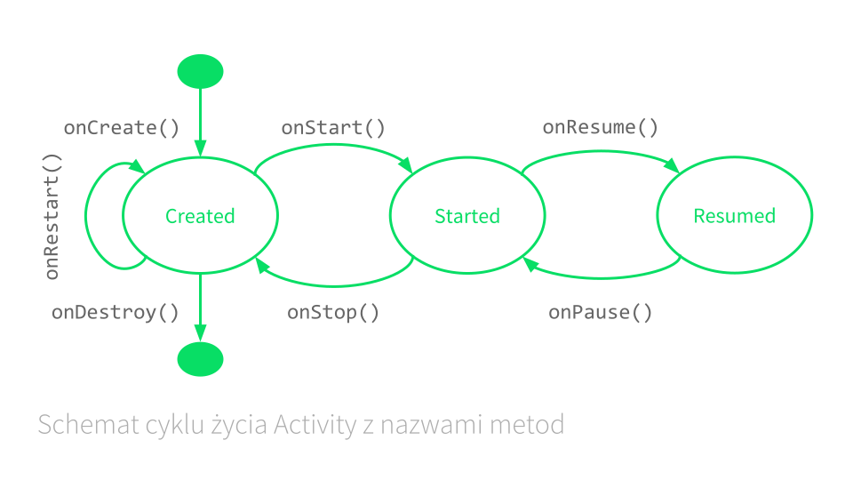
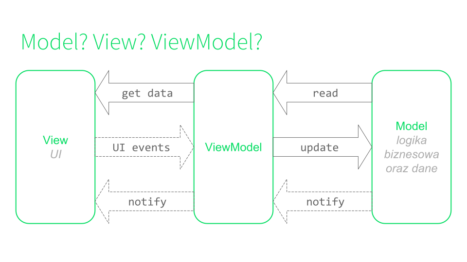
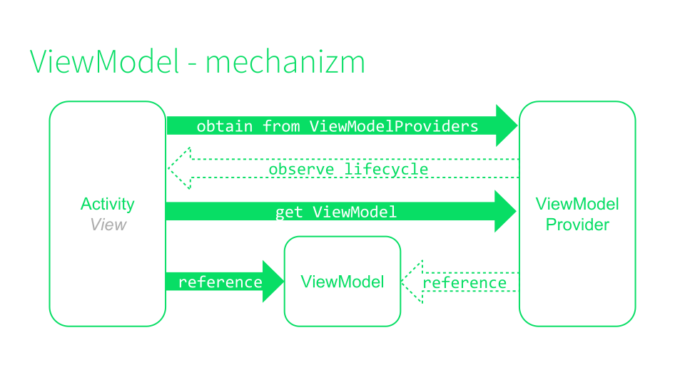
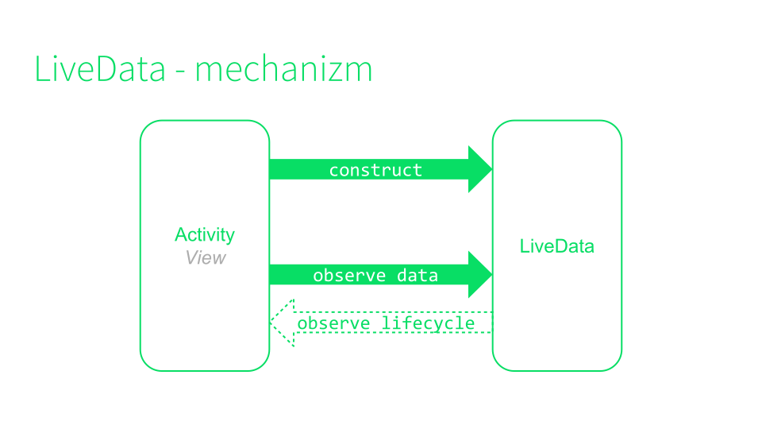

# Zajęcia Android 4 Beginners – WEiTI, jesień 2018

## Plan zajęć

## Zajęcia

### Zajęcia 1. Hello, world! from Kotlin

Było dużo o charakterystycznych elementach składni Kotlina i nowych mechanizmach odróżniających go od Javy (immutable collections, extension functions). W sekcji [Materiały](#Materiały) jest link do ćwiczeń z Kotlina (Kotlin Koans). Polecam, jeśli chcecie poćwiczyć przed następnymi zajęciami.

W folderze Android4Beginners1 znajdziecie kod z pierwszych zajęć wzbogacony o komentarze.

### Zajęcia 2. Pierwszy ekran

Poruszyliśmy temat pięciu głównych aspektów tworzenia UI:

 1. `View` oraz `ViewGroup` - bloczki, z których składamy widoki w Androidzie
 1. [XML](https://developer.android.com/guide/topics/ui/declaring-layout#write) - jak tworzyć layouty za pomocą składni znaczników xml
 1. [Style](https://developer.android.com/guide/topics/ui/look-and-feel/themes) - jak uwspólniać wygląd elementów a także rozszerzać już istniejące style
 1. [Resources](https://developer.android.com/guide/topics/resources/providing-resources), czyli statyczne elementy aplikacji
 1. [Kwalifikatory](https://developer.android.com/guide/topics/resources/providing-resources#AlternativeResources) - sposób na obsługę wielu urządzeń i języków oraz wielu innych zmiennych właściwości urządzeń z Androidem

W podpunktach znajdziecie linki do guide'ów z androidowej dokumentacji (link do całości w sekcji **Materiały**).

### Zajęcia 3. Lifecycle, Context, Intent

Zajęcia rozpoczęliśmy od krótkiego omówienia `Activity` i jego cyklu życia.

Później zajęliśmy się omówieniem `Contextu`, `Intentami` oraz otwieraniem innych `Activity`. Pokazałem też, jak opakowywać w `Intentach` dodatkowe dane i przenosić je między różnymi `Activity`. To, co stworzyliście w trakcie zajęć, powinno wystarczyć jako notatki. Gdyby jednak ktoś szukał pomocy, polecam [ten](https://developer.android.com/training/basics/firstapp/starting-activity.html#kotlin) fragment przewodnika.

Powiedzieliśmy sobie też, czym są *implicit* `Intenty` oraz jak je wykorzystywać do komunikacji z systemem.

Na koniec wspomnieliśmy o tym, że korzystamy z *supportu*, by minimalizować wpływ fragmentacji na nasze życie (przynajmniej w aspekcie programowania na Androida).

### Zajęcia 4. A little architecture

Zaczęliśmy od tego, że należy `Activity` traktować jako komponent, za pomocą którego użytkownik komunikuje się z naszą aplikacją. W związku z powyższym, powinniśmy nasze `Activities` w miarę możliwości odciążać od zdań niezwiązanych z wyświetlaniem treści i obsługą zdarzeń.

Pokazaliśmy sobie, jak do tego celu wykorzystać wzorzec [MVVM](https://en.wikipedia.org/wiki/Model%E2%80%93view%E2%80%93viewmodel). Było też trochę o tym, jak skonstruować prostą warstwę **modelu**, z którą może się komunikować nasz `ViewModel`.

Rozwinęliśmy temat ViewModelu i omówiliśmy oferowaną przez Googlersów klasę [ViewModel](https://developer.android.com/topic/libraries/architecture/viewmodel.html) z biblioteki  **Android Architecture Components**.  Potrafi on rozpoznać, co dzieje się z naszym `Activity`, dzięki czemu nie musimy przejmować się utratą stanu i naszych danych.

Nauczyliśmy się także wykorzystywać [LiveData](https://developer.android.com/topic/libraries/architecture/livedata.html) do zarządzania zasobożernymi serwisami udostępnianymi przez platformę, takimi jak dane z **sensorów** czy **geolokalizacja**. Przykład znajdziecie w projekcie `Android4Beginners4`. Wykorzystaliśmy też tę klasę do obserwowania danych w tworzonych przez nas view-modelach.

Na koniec poruszyliśmy temat związany z *UI*, czyli **Options menu** znane z wielu androidowych aplikacji. Więcej na ten temat możecie przeczytać [tutaj](https://developer.android.com/guide/topics/ui/menus.html#options-menu).

## Materiały

- [Kotlin Koans](http://kotlinlang.org/docs/tutorials/koans.html)
- [Android Developers](https://developer.android.com/index.html)

## Kontakt

- [E-mail](mailto:android@daftacademy.pl)
