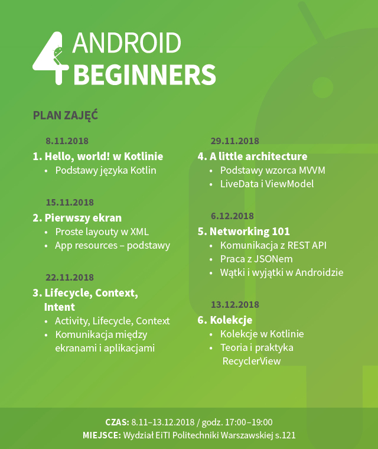

# Zajęcia Android 4 Beginners – WEiTI, jesień 2018

## Plan zajęć

## Zajęcia

### Zajęcia 1. Hello, world! from Kotlin

Było dużo o charakterystycznych elementach składni Kotlina i nowych mechanizmach odróżniających go od Javy (immutable collections, extension functions). W sekcji [Materiały](#Materiały) jest link do ćwiczeń z Kotlina (Kotlin Koans). Polecam, jeśli chcecie poćwiczyć przed następnymi zajęciami.

W folderze Android4Beginners1 znajdziecie kod z pierwszych zajęć wzbogacony o komentarze.

## Materiały

- [Kotlin Koans](http://kotlinlang.org/docs/tutorials/koans.html)
- [Android Developers](https://developer.android.com/index.html)

## Kontakt

- [E-mail](mailto:android@daftacademy.pl)
